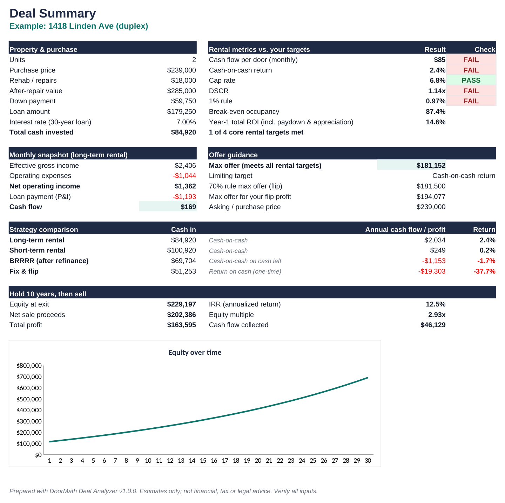

# DoorMath: Rental Property Deal Analyzer

**Know your max offer before you call the agent.**

DoorMath is a spreadsheet (Excel, Google Sheets, LibreOffice) that runs a property as a long-term rental, a BRRRR, a fix & flip and an Airbnb / short-term rental. It adds a 30-year projection with the IRR if you sell in any year, sensitivity grids, a five-deal comparison, and a max-offer solver that finds the highest price that still meets your targets.

- **Free calculator & worked examples:** https://liukai1949701-ux.github.io/claudef/
- **The workbook ($29, one-time) in the DoorMath store:** https://qzgfrd-s1.myshopify.com/products/doormath-rental-property-deal-analyzer (the store is not taking orders yet)



## What's in this repository

This repository holds the **free DoorMath site**, published with GitHub Pages. It is an educational tool, not a shop: the workbook is sold and delivered by the DoorMath store, and the site links there once.

- `index.html`: the free long-term-rental calculator, the worked examples, a short section about the workbook, and the FAQ.
- `examples/`: four worked examples with every formula and number shown: max offer, BRRRR refinance, Airbnb vs. long-term rental, and cash-on-cash vs. cap rate vs. DSCR. Their figures come from the same reference model the workbook is tested against.
- `404.html`, `assets/`: the error page, styles, scripts, screenshots and product images.
- `assets/calc-core.js`: the calculator math. It matches the workbook's Rental tab and is tested against 83 cases from the workbook's reference model (`tests/calc.test.mjs`).
- `tests/site_check.py`: a Playwright browser check of the home page and every example page. It covers console errors, failed and external requests, layouts from 320px to 1440px, the calculator, the lightbox, internal links and anchors, and the store links (product URL with UTM tags).
- `.github/verify_live.py` (on the `gh-pages` branch): a GitHub Actions check of the live site. It checks every page, asset and link, confirms the store URL, confirms the paid files can't be reached, and scans the full git history for them.

Store links carry `utm_source=doormath-free-site`, `utm_medium=referral` and a per-link `utm_campaign`, so the store's analytics can attribute visits and sales to this site.

The paid workbook is **not** in this repository. It is delivered as a download after purchase.

## What buyers get

`DoorMath-Deal-Analyzer-v1.0.0.zip`:

| File | Contents |
| --- | --- |
| `DoorMath-Deal-Analyzer.xlsx` | The workbook, pre-filled with a worked example |
| `DoorMath-Deal-Analyzer-Blank.xlsx` | Property fields empty, typical assumptions pre-filled |
| `DoorMath-Quick-Start-Guide.pdf` | 6-page walkthrough |
| `README.txt`, `LICENSE.txt`, `CHANGELOG.txt` | Setup notes, license (personal and single-business use), version history |

Tabs: Start Here, Inputs, Summary, Rental, Max Offer, BRRRR, Flip, STR, Projection, Sensitivity, Compare, Amortization, Glossary.

## Honest limits

- Income taxes, depreciation, capital-gains tax and 1031 exchanges are not modeled. Every rate and price is your input.
- Tested by recalculating in LibreOffice. It uses only functions supported by Excel 2010+ and Google Sheets. Apple Numbers is not supported.
- An analysis tool, not financial, tax, legal or investment advice.

## Run the site locally

```bash
python3 -m http.server 8000        # then open http://localhost:8000
node tests/calc.test.mjs           # calculator math vs. reference fixtures
python3 tests/site_check.py        # browser checks (needs Playwright; CHROMIUM_PATH=/path/to/chrome optional)
```

© 2026 DoorMath. All rights reserved.
